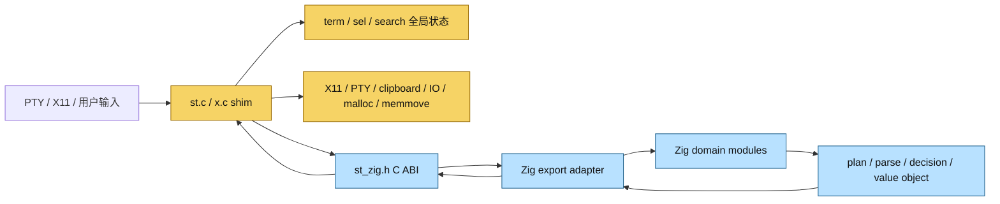
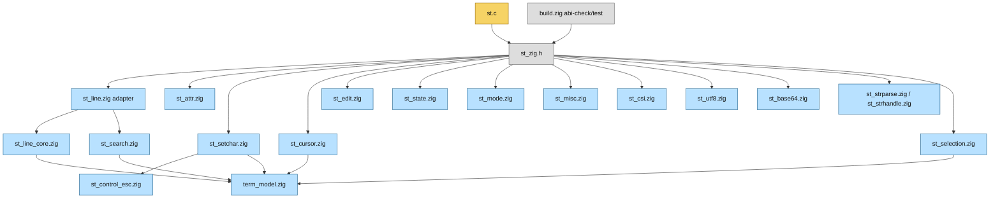
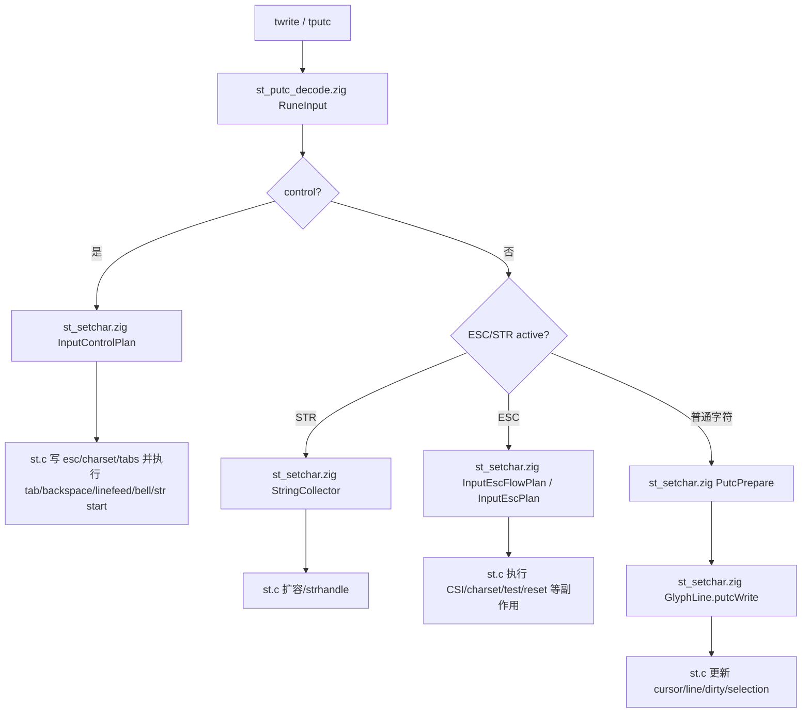
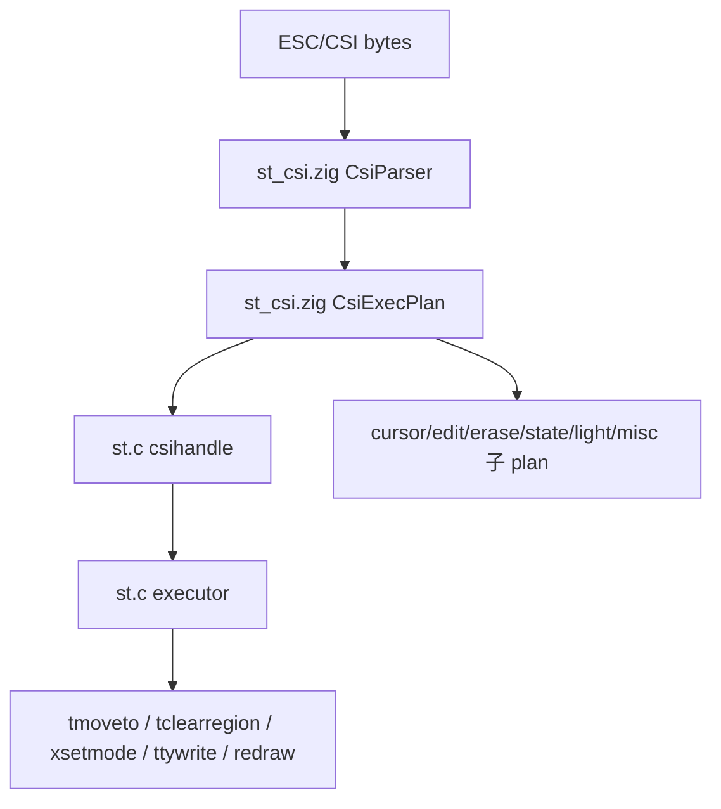
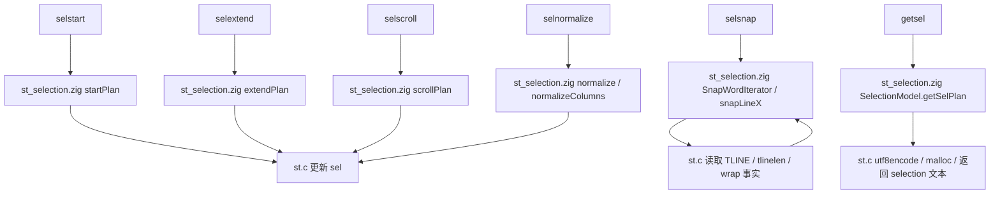
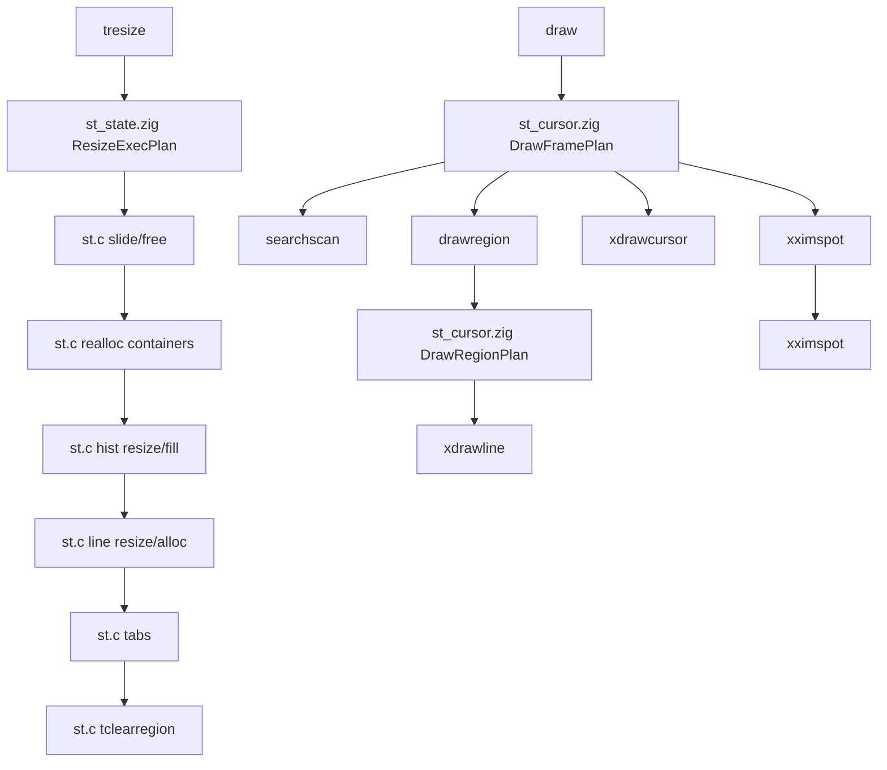
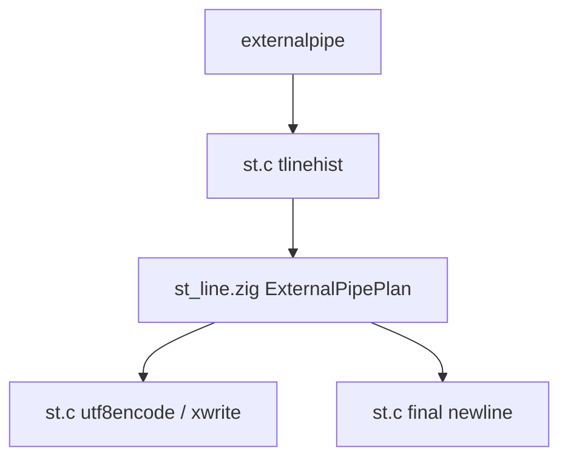

# 架构流程图

本文档补充 `docs/zig-architecture.md`：前者描述边界规则，本文描述主要流程、模块关系和后续迁移路线。当前路线已从“长期 C executor”调整为“先压缩成极薄 C shim，再逐步迁到 Zig 主导”。

## C/Zig 边界总览



- 当前 C 侧仍持有全局状态和实际副作用，包括 `term`、`sel`、`search`、X11、PTY、clipboard、IO、内存所有权和 `TLINE(...)` 数组访问。
- 目标形态是：Zig 逐步持有状态与主线决策，C 收缩成只执行平台桥接和副作用的极薄 shim。
- `st_zig.h` 目前仍是唯一公开 ABI，`zig build abi-check` 校验 Zig `export fn st_*` 与头文件声明一致；后续它应逐步退化为过渡兼容层。

## 模块关系图



## 输入处理流程



## CSI/ESC 处理流程



当前状态：`csihandle()` 已收敛为单一 `st_csiexecplan()` 顶层 command plan；C 侧只按 command kind 执行 `tapply*`、`tsetmode`、`tsetattr` 和 `xsetcursor` 等副作用。旧 `st_plancursor`、`st_planedit`、`st_planerase`、`st_planlight`、`st_planstate`、`st_planmisc` ABI 已删除。Input 主线已删除旧 `st_tcontrolexec`、`st_tescexec`、`st_tescflow`、`st_tescflowafter`、`st_tcontrolafter`、`st_tcontrolfinish` 碎片 ABI，改由 `InputControlPlan`、`InputEscPlan`、`InputEscFlowPlan` 返回状态写回计划。

Mode action 补充状态：`1049/47/1047/1048` alternate screen / cursor save-load 路径已从 C fallthrough 收口为 `ZigModePlan` action fields；mouse mode 路径也已由 Zig 决定 `pointer_motion`、`clear_mouse_mode` 和 `mouse_mode`；origin/visibility/simple bit actions 也已改为 Zig 返回最终 action fields。C 保留 `allowaltscreen` gate，并执行 `tcursor`、`tclearregion`、`tswapscreen`、`xsetpointermotion`、`xsetmode`、`tmoveato` 与 bit write 副作用；unknown diagnostics 仍留在 C。

## Search 子系统流程

当前状态：主流程完成，近期已做多轮 ABI 瘦身，并已把 search 资源释放与 jump/redraw effect 集中到 C helper。`st_search*` export 和写模型 adapter 已下沉到 `st_search.zig`；C 侧 `searchsnapshot()` / `searchapplyupdate()` 的标量字段映射也已收口到 `SearchScalarState`，并开始被 `searchnext/searchprev/searchjump/searchscan/searchmatch` 等调用点消费。`input` mutation transaction 与 `query` alloc/apply phase 也已经拆出独立 seam。当前结论是：`query` ownership 暂不迁移，优先保持 C 持有指针与生命周期，把收益集中在事务收口和 effect 时序稳定上。

第一版契约：C 先通过 `SearchScalarState` 组装 `SearchSnapshot`，把 `query/input/matches` 作为切片或指针单独传给 Zig；search adapter implementation 统一进入 `SearchModel`，返回 `SearchStateUpdate` 和 `SearchEffectPlan`，C 通过集中 helper 执行资源释放、jump/redraw 等副作用，并经 `SearchScalarState` 做最终写回。对于 `query`，C 继续持有 `Rune *` 指针和 free 生命周期，当前只通过 alloc/apply phase seam 收口事务，不做 ownership 迁移。

```mermaid
flowchart TD
    Prompt[searchprompt] --> PromptPlan[st_search.zig PromptPlan]
    PromptPlan --> CAlloc[st.c 可选 xmalloc]

    Input[searchinput text] --> InsertPlan[st_search.zig InsertPlan]
    InsertPlan -->|grow| CRealloc[st.c xrealloc]
    InsertPlan --> CMove[st.c memmove/memcpy]
    CMove --> SearchSet[searchset]

    CursorKeys[backspace/delete/move/home/end] --> CursorEdit[st_search.zig CursorEdit union]
    CursorEdit --> CursorResult[st_search.zig SearchCursorResult]
    CursorResult --> ApplyEdit[st.c searchapplycursor]
    ApplyEdit -->|delete| CDelete[st.c searchdelete memmove]
    ApplyEdit -->|move| CCursor[更新 search.inputcursor]
    CDelete --> SearchSet
    CCursor --> Redraw[redraw]

    StateKeys[clear/commit/cancel] --> StateEdit[st_search.zig StateEdit union]
    StateEdit --> StateResult[st_search.zig SearchStateResult]
    StateResult --> ApplyState[st.c searchapplystate]
    ApplyState -->|clear_input| SearchSet
    ApplyState -->|commit_set| SearchSet
    ApplyState -->|commit_clear| SearchClear[searchclear free/reset]
    ApplyState -->|cancel| Redraw

    SearchSet --> DecodeQuery[st.c utf8decode query]
    DecodeQuery --> Snapshot[SearchSnapshot]
    Snapshot --> Update[SearchStateUpdate]
    Snapshot --> Effect[SearchEffectPlan]
    Update --> Scan[searchscan]
    Effect --> CEffects[xmalloc/xrealloc/free/redraw/searchjump]
    CEffects --> Scan
    Scan --> LinePlan[st_search.zig SearchScanIterator]
    LinePlan -->|grow_append| MatchRealloc[st.c xrealloc matches]
    LinePlan --> MatchWrite[st.c 写 SearchMatch]
    MatchWrite --> MatchList[st_search.zig MatchList slice]
    MatchList --> DrawHit[searchmatch/searchcurrent]

补充状态：`matches` 的扩容判定、scan line loop state 和 scan 结束后的 `nmatches/current` 归一化已都迁入 Zig；C 侧仍保留 `xrealloc` 和 `SearchMatch` 数组写入。当前不迁 `matches` ownership，因为 pointer 生命周期和真实数组写入仍是 C shim 的自然 effect。
```

## Selection 子系统流程

当前状态：主流程完成，后续只做局部优化或无用 ABI 删除。C 侧保留 selection 全局状态写回、`TLINE(...)` glyph 读取、clipboard 文本分配和 UTF-8 编码；Zig 侧通过 `SelectionModel` 负责 start、extend、normalize、scroll、word snap loop 控制、选中判断和 getsel 行范围计划。

补充状态：`selection` 已进入统一快照阶段，`selstart/selextend/selscroll` 改由 `SelectionSnapshot -> SelectionStateResult` 驱动；`selected/getsel` 也已改为 snapshot interface，不再向 ABI 暴露 `sel.type`、`nb/ne` 等散字段；C 侧通过 `selectionsnapshot()`、`selectionapplystate()` 和 `selectionapplybounds()` 集中处理 `sel` 字段映射，调用点只保留 effect 执行；`selsnap()` 的 `SNAP_WORD` 路径现已改为 `SnapWordIterator` 两阶段 seam：Zig 先返回 `read/stop` 请求，C 只读取 glyph、line length 和 wrap 事实，再回填给 Zig 获取 `accept/stop` 结果。当前不迁 `sel` ownership，因为 glyph 读取、selection 文本分配、UTF-8 编码和 clipboard 输出仍是 C shim 的自然 effect。



## Resize/Draw 流程



## Line/ExternalPipe 流程



当前状态：`externalpipe()` 已合并为单一 `st_externalpipeplan()`，Zig 同时规划行长度、输出范围和 wrap newline；C 侧保留历史/当前行指针获取、UTF-8 编码、pipe/fork/exec/xwrite 和 signal 处理。`st_tlinehistplan()` 已下沉到 `st_search.zig`，因为 history ring 映射与 search/history locality 更一致；ExternalPipe 保留在 `st_line.zig`，因为它直接依赖 `VisualLine`、line length 和 wrap newline 语义。

## 后续迁移路线图


- **Search 第一优先级**：主流程纯逻辑已稳定，且小 ABI 已大幅收薄；下一步开始定义 `SearchSnapshot`、`SearchStateUpdate` 和 `SearchEffectPlan`，让 Zig 逐步接管 `search` 读写模型。
- **Selection 定版**：主流程完成，`selected/getsel` 已改为 snapshot interface，line snap step 和 word snap loop step 已 plan 化，selection adapter implementation 与 export 已下沉到 `st_selection.zig`；C 侧只保留 `TLINE(...)` glyph 读取、delimiter 判断、selection 全局状态写回和 clipboard 文本输出。
- **Resize 收口**：`tresize` 已按 `ZigResizeExecPlan` 执行 slide/free、container realloc、hist resize/fill、line resize/alloc、tabs 和 clear；C 继续执行 `xrealloc/free/memmove/xmalloc/memset/tclearregion`。
- **Draw 收口**：draw frame gate、cursor 调整和 draw region dirty 扫描已迁移为 Zig plan；C 侧只表达 `xstartdraw`、searchscan、drawregion、cursor、IME 和 `xfinishdraw` 副作用链。
- **CSI 聚合**：`csihandle` 已改为 `ZigCsiExecPlan` 顶层分发，六个旧 `st_plan*` 小 ABI、旧私有 planner 和 `st_light.zig` 重复模块已删除；C 继续执行真实副作用。
- **ExternalPipe 聚合**：行长度、write/skip、lastpos 和 wrap newline 已合并为 `st_externalpipeplan`；C 继续负责 `tlinehist`、`utf8encode` 和 `xwrite`。`tlinehist` 的 history plan export 已下沉到 `st_search.zig`。
- **ABI 瘦身**：`st_zig.h` 仍只保留 C shim 实际调用入口；已清理多轮旧 `st_plan*`、search/mode/strhandle 小 helper，以及 `st_tdectest`、`st_ttywritecount`、`st_tprinterwrite`、`st_sttyfits`、`st_ttyreadpending`、`st_tscrollselplan`、`st_csiprivbool` 等 pass-through exports。后续新增边界优先是 snapshot/update/effect 结构，而不是新的零碎 `st_*` 导出。
- **验证要求**：每批迁移后执行 `zig fmt`、`zig build abi-check`、`zig build test`、`zig build`；提交或发布前补 `timeout 5 ./zig-out/bin/st`。
