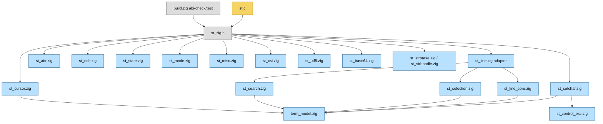
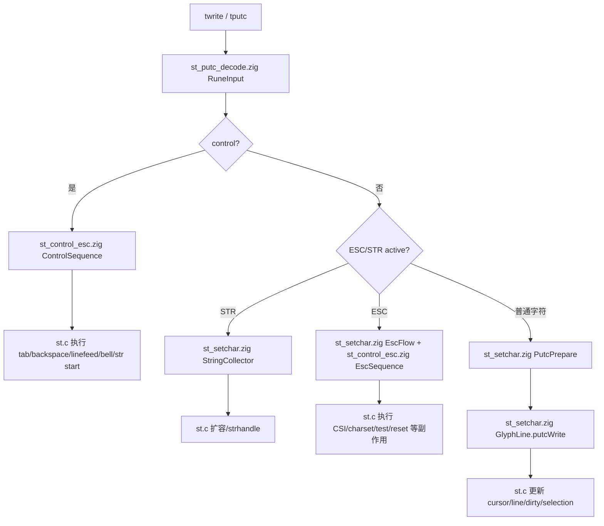
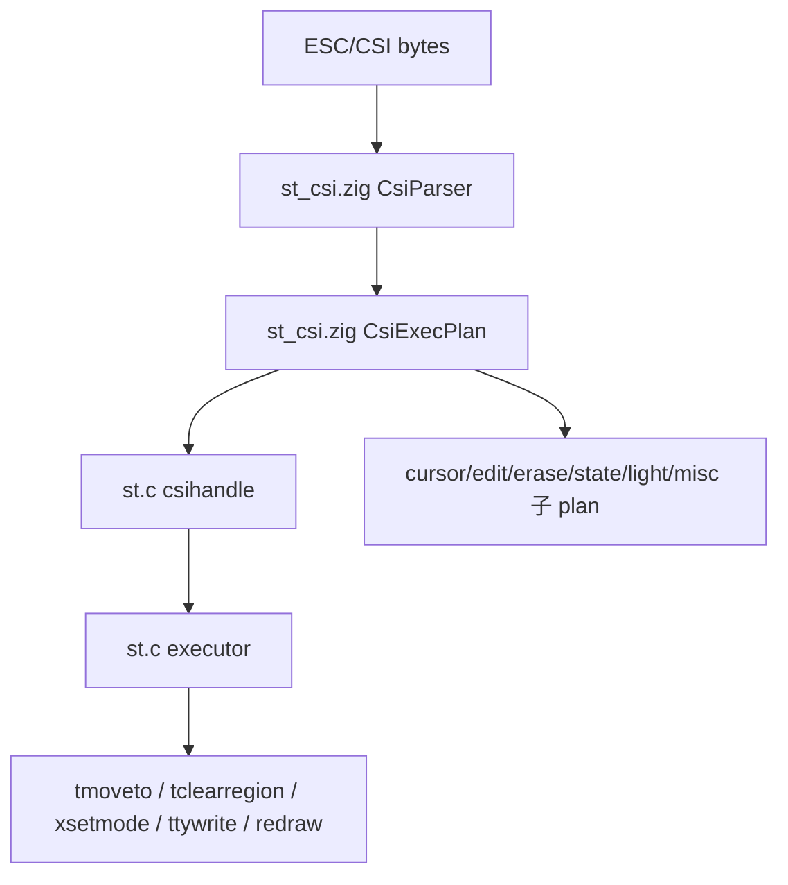
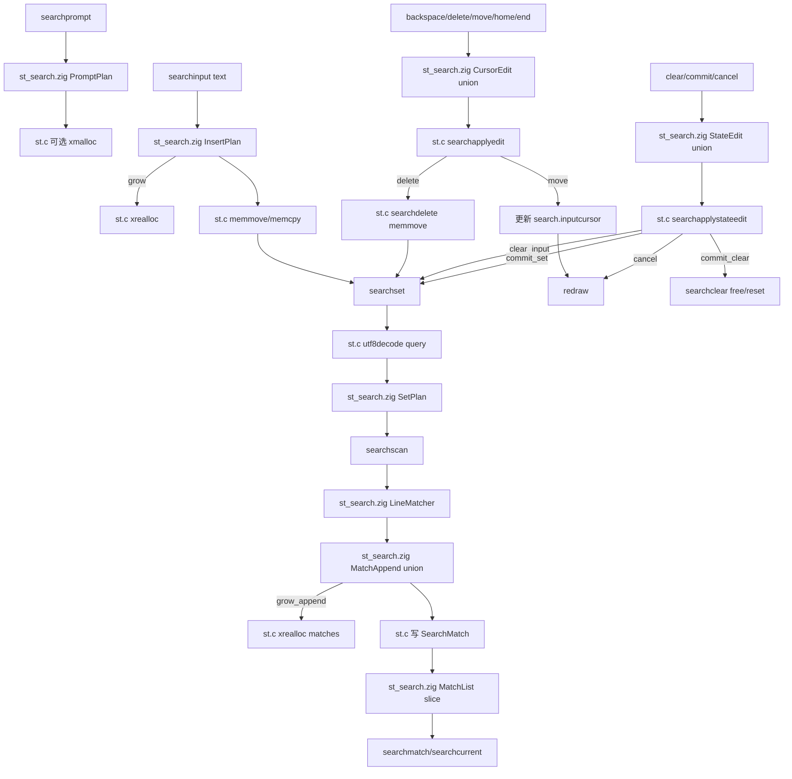
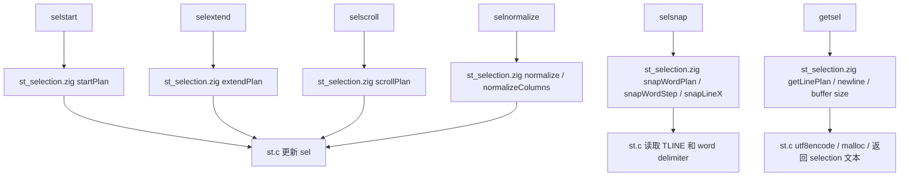
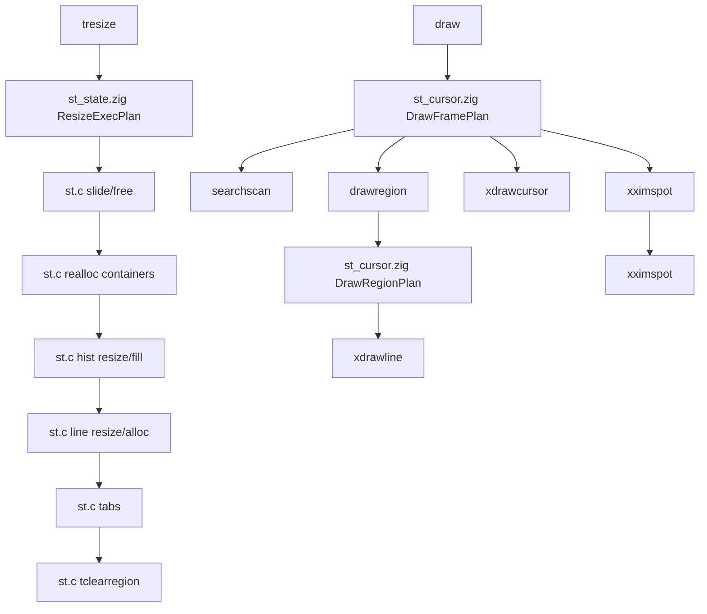
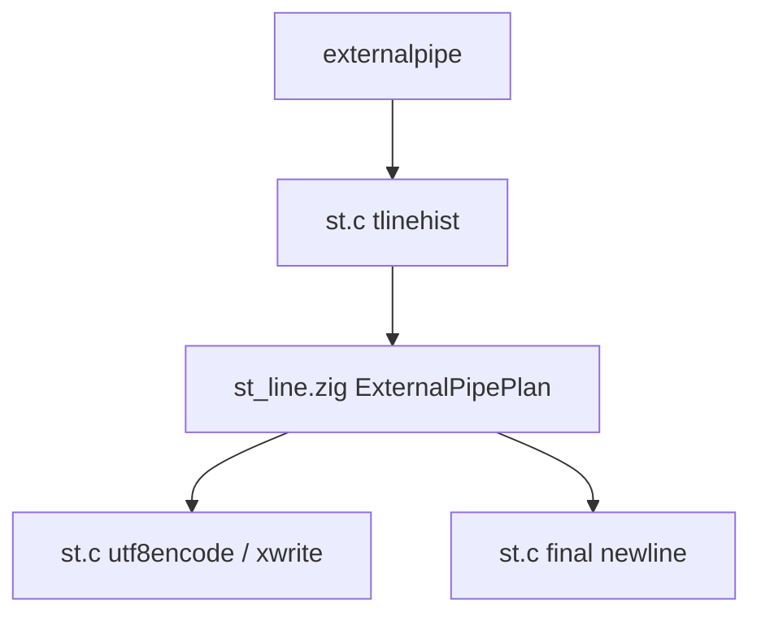

# 架构流程图

本文档补充 `docs/zig-architecture.md`：前者描述边界规则，本文描述主要流程、模块关系和后续迁移路线。

## C/Zig 边界总览

- C 侧持有全局状态和实际副作用，包括 `term`、`sel`、`search`、X11、PTY、clipboard、IO、内存所有权和 `TLINE(...)` 数组访问。
- Zig 侧只接收显式值、指针切片或 extern struct，返回可测试 plan；内部模块不读取 C 全局变量。
- `st_zig.h` 是唯一公开 ABI，`zig build abi-check` 校验 Zig `export fn st_*` 与头文件声明一致。

## 模块关系图

## 输入处理流程

## CSI/ESC 处理流程

当前状态：`csihandle()` 已收敛为单一 `st_csiexecplan()` 顶层 command plan；C 侧只按 command kind 执行 `tapply*`、`tsetmode`、`tsetattr` 和 `xsetcursor` 等副作用。旧 `st_plancursor`、`st_planedit`、`st_planerase`、`st_planlight`、`st_planstate`、`st_planmisc` ABI 已删除。

## Search 子系统流程

当前状态：主流程完成，后续只做局部优化或无用 ABI 删除。C 侧保留搜索扫描所需的 `TLINE(...)` 读取、匹配数组写入、输入缓冲区内存移动和 redraw/free 等副作用；Zig 侧负责输入编辑、扫描范围、match append、current/jump 和状态动作计划。

## Selection 子系统流程

当前状态：主流程完成，后续只做局部优化或无用 ABI 删除。C 侧保留 selection 全局状态写回、`TLINE(...)` glyph 读取、delimiter 判断、clipboard 文本分配和 UTF-8 编码；Zig 侧负责 normalize、extend、scroll、snap step、选中判断和 getsel 行范围计划。

## Resize/Draw 流程

## Line/ExternalPipe 流程

当前状态：`externalpipe()` 已合并为单一 `st_externalpipeplan()`，Zig 同时规划行长度、输出范围和 wrap newline；C 侧保留历史/当前行指针获取、UTF-8 编码、pipe/fork/exec/xwrite 和 signal 处理。

## 后续迁移路线图

- **Search 定版**：主流程完成，旧 `st_search*plan` 兼容入口和测试专用 ABI 已删除；C 侧只保留扫描所需 `TLINE(...)`、匹配数组写入、输入缓冲区移动和 redraw/free 等副作用。
- **Selection 定版**：主流程完成，line snap step 和 word snap loop step 已 plan 化；C 侧只保留 `TLINE(...)` glyph 读取、delimiter 判断、selection 全局状态写回和 clipboard 文本输出。
- **Resize 收口**：`tresize` 已按 `ZigResizeExecPlan` 执行 slide/free、container realloc、hist resize/fill、line resize/alloc、tabs 和 clear；C 继续执行 `xrealloc/free/memmove/xmalloc/memset/tclearregion`。
- **Draw 收口**：draw frame gate、cursor 调整和 draw region dirty 扫描已迁移为 Zig plan；C 侧只表达 `xstartdraw`、searchscan、drawregion、cursor、IME 和 `xfinishdraw` 副作用链。
- **CSI 聚合**：`csihandle` 已改为 `ZigCsiExecPlan` 顶层分发，六个旧 `st_plan*` 小 ABI 已删除；C 继续执行真实副作用。
- **ExternalPipe 聚合**：行长度、write/skip、lastpos 和 wrap newline 已合并为 `st_externalpipeplan`；C 继续负责 `tlinehist`、`utf8encode` 和 `xwrite`。
- **ABI 瘦身**：`st_zig.h` 只保留 C executor 实际调用入口；仅 Zig 测试引用的 export 应删除，测试改测内部领域函数。
- **验证要求**：每批迁移后执行 `zig fmt`、`zig build abi-check`、`zig build test`、`zig build`；提交或发布前补 `timeout 5 ./zig-out/bin/st`。
