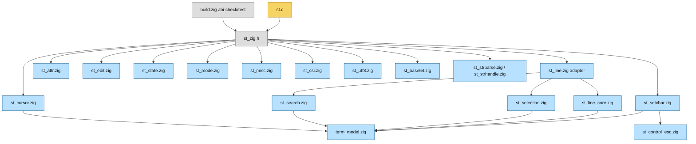
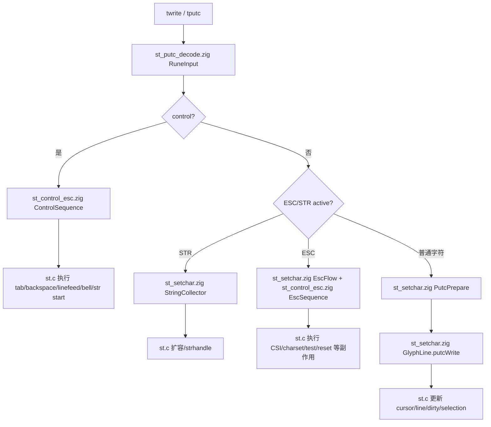
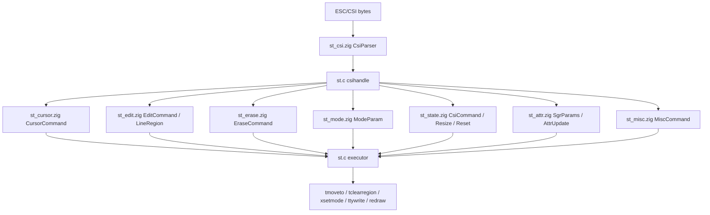
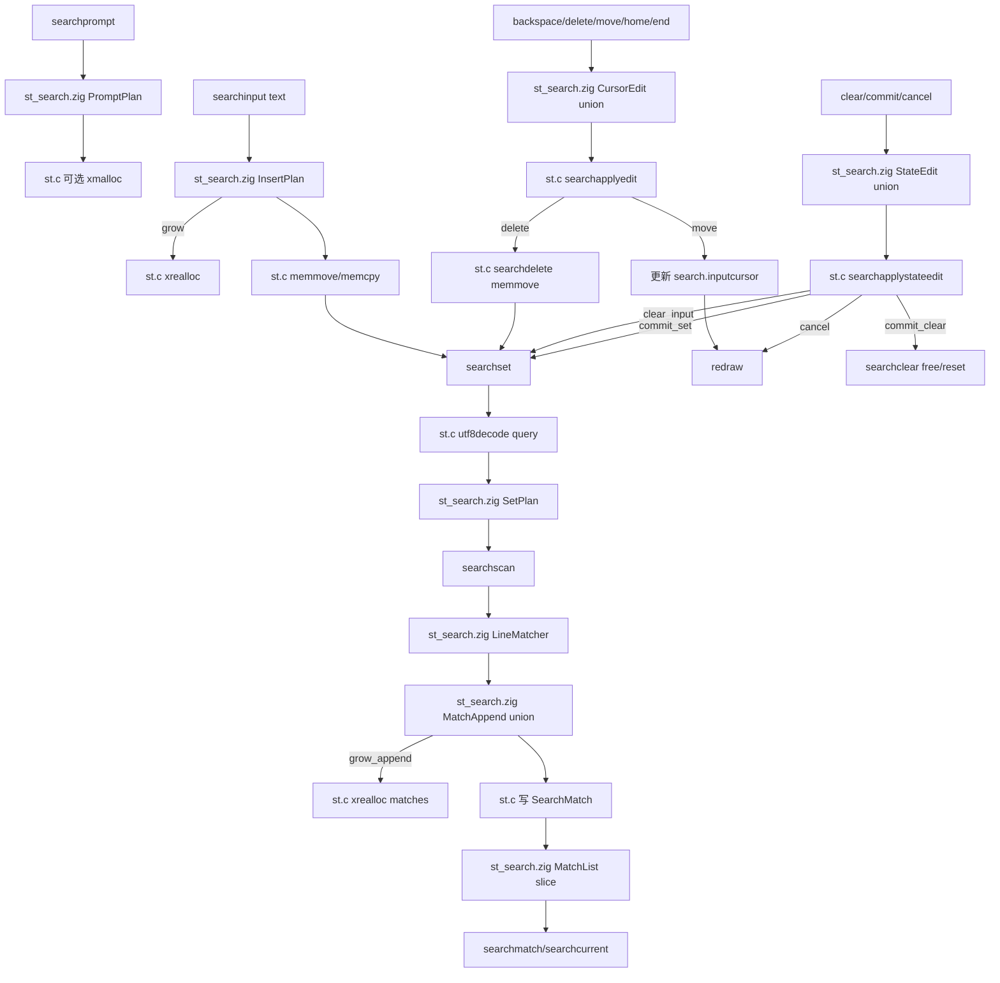
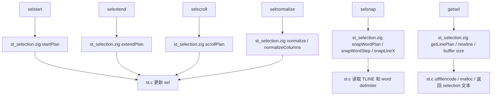
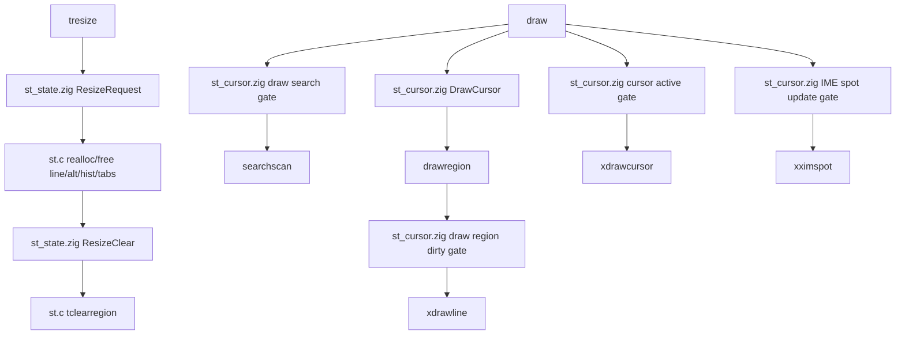

# 架构流程图

本文档补充 `docs/zig-architecture.md`：前者描述边界规则，本文描述主要流程、模块关系和后续迁移路线。

## C/Zig 边界总览

- C 侧持有全局状态和实际副作用，包括 `term`、`sel`、`search`、X11、PTY、clipboard、IO、内存所有权和 `TLINE(...)` 数组访问。
- Zig 侧只接收显式值、指针切片或 extern struct，返回可测试 plan；内部模块不读取 C 全局变量。
- `st_zig.h` 是唯一公开 ABI，`zig build abi-check` 校验 Zig `export fn st_*` 与头文件声明一致。

## 模块关系图

## 输入处理流程

## CSI/ESC 处理流程

## Search 子系统流程

## Selection 子系统流程

## Resize/Draw 流程

## 后续迁移路线图

- **Search 清理**：旧 `st_search*plan` 兼容入口已删除，C 侧保留 `CursorEdit`、`StateEdit`、`MatchAppend` 和实际仍调用的 plan 入口。
- **Selection 提升**：line snap step 和 word snap loop step 已改成 tagged union，旧 word snap 辅助 ABI 已清理；C 保留 `TLINE` 访问和 delimiter 判断。
- **Resize 提升**：tab 初始化、history 新列填充、line resize 和新行分配范围已迁移为 Zig plan；C 继续执行 `xrealloc/free`。
- **Draw 收敛**：继续把 draw region 的范围、dirty line 决策聚合，C 继续调用 `xdrawline/xdrawcursor/xximspot`。
- **验证要求**：每批迁移后执行 `zig fmt`、`zig build abi-check`、`zig build test`、`zig build`；提交或发布前补 `timeout 5 ./zig-out/bin/st`。
